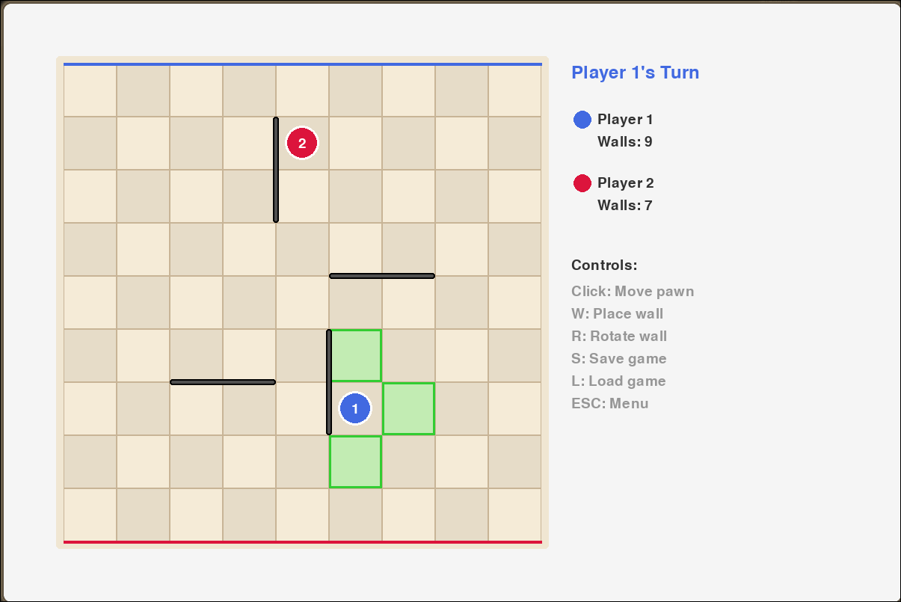

# Quoridor Game

A complete implementation of the strategic board game Quoridor with GUI and AI opponents.



## Game Description

Quoridor is an award-winning abstract strategy board game where players race to reach the opposite side of the board while strategically placing walls to block their opponents. The game combines simple rules with deep strategic gameplay.

### Rules
- **Board**: 9×9 grid
- **Players**: 2 players
- **Objective**: Be the first to reach the opposite side
- **Each Turn**: Move your pawn OR place a wall
- **Movement**: One square orthogonally (up/down/left/right)
- **Walls**: 2 squares long, placed on edges between squares
- **Constraint**: Walls cannot completely block any player's path to their goal

## Features

### Core Features
- ✅ Complete Quoridor ruleset implementation
- ✅ Beautiful Pygame-based GUI
- ✅ Human vs Human mode
- ✅ Human vs AI mode
- ✅ Valid move highlighting
- ✅ Pathfinding algorithm ensures fair wall placement
- ✅ Turn indicator and wall counter

### Bonus Features
- ✅ **Multiple AI Difficulty Levels**: Easy, Medium, Hard
- ✅ **Save/Load Game**: Save your game and continue later
- ✅ Clean, intuitive interface

## Installation

### Prerequisites
- Python 3.8 or higher
- pip package manager

### Setup
```bash
# Clone the repository
git clone https://github.com/yourusername/quoridor-game.git
cd quoridor-game

# Install dependencies
pip install -r requirements.txt
```

## Running the Game

```bash
python main.py
```

## Controls

### Main Menu
- Click on game mode buttons to start a game
- Choose AI difficulty (Easy/Medium/Hard) when playing vs Computer

### During Gameplay

**Moving Your Pawn:**
- Click on a valid adjacent square (highlighted in green) to move

**Placing a Wall:**
- Press `W` to enter wall placement mode
- Click on the board to place a horizontal wall
- Press `R` to rotate wall (horizontal ↔ vertical)
- Click again to confirm placement
- Press `ESC` to cancel wall placement

**Other Controls:**
- `S` - Save game
- `L` - Load saved game
- `ESC` - Return to main menu
- `R` - Restart game (when game is over)

## AI Algorithms

### Easy AI
- Random valid move selection
- 50% chance to move pawn, 50% to place wall
- Good for beginners learning the game

### Medium AI
- Greedy pathfinding strategy
- Always tries to minimize distance to goal
- Places walls to maximize opponent's path length
- Moderate challenge

### Hard AI
- Minimax algorithm with alpha-beta pruning
- Advanced heuristics:
  - Path length differential
  - Wall count advantage
  - Positional control
  - Blocking opportunities
- Searches 3-4 moves ahead
- Provides challenging gameplay

## Project Structure

```
quoridor-game/
├── main.py              # Entry point
├── game/
│   ├── __init__.py
│   ├── board.py         # Board logic and pathfinding
│   ├── player.py        # Player class
│   ├── wall.py          # Wall class
│   └── game_state.py    # Game state management
├── ai/
│   ├── __init__.py
│   ├── base_ai.py       # Base AI class
│   ├── easy_ai.py       # Easy difficulty
│   ├── medium_ai.py     # Medium difficulty
│   └── hard_ai.py       # Hard difficulty (minimax)
├── ui/
│   ├── __init__.py
│   ├── renderer.py      # Pygame rendering
│   ├── menu.py          # Menu system
│   └── colors.py        # Color constants
├── utils/
│   ├── __init__.py
│   └── save_load.py     # Save/load functionality
├── requirements.txt
└── README.md
```

## Demo Video

[Watch the demo video here](https://youtu.be/your-video-link)

## Development

### Design Decisions
- **Pygame for GUI**: Chosen for smooth graphics and game-oriented features
- **BFS for Pathfinding**: Ensures every wall placement maintains valid paths
- **Minimax for Hard AI**: Classic game tree search for optimal moves
- **MVC Pattern**: Separation of game logic, AI, and UI

### Challenges and Solutions
- **Wall Validation**: Implemented BFS to verify both players have valid paths
- **AI Performance**: Alpha-beta pruning to make Hard AI responsive
- **UI Intuitiveness**: Visual feedback for all valid moves and wall placements

## Credits

Developed by [Your Name]

Game designed by Mirko Marchesi (1997)

## License

MIT License - feel free to use for educational purposes
